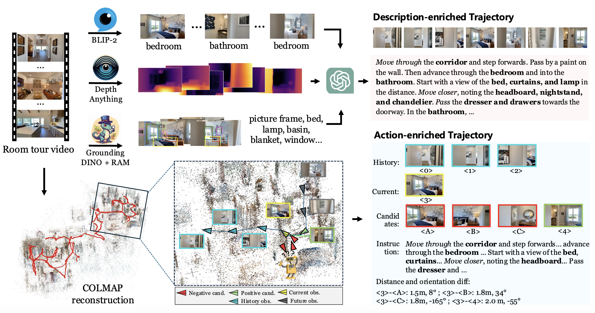

# RoomTour3D: Geometry-Aware Video-Instruction Tuning for Embodied Navigation


<div align="center" margin-bottom="3em">
    <a href="http://arxiv.org/abs/2412.08591" target="_blank">
    </a>
    <a href="https://opensource.org/licenses/MIT" target="_blank">
    </a>
    <a href="https://huggingface.co/datasets/roomtour3d/roomtour3d" target="_blank">
    </a>
    <a href="https://huggingface.co/datasets/roomtour3d/room_tour_video_3fps" target="_blank">
    </a>
    <a href="https://huggingface.co/roomtour3d/roomtour3d-navillm-models" target="_blank">
    </a>
    <!-- <a href="https://opensource.org/licenses/MIT" target="_blank">
    </a> -->

</div>
&nbsp

<div align="center" margin-bottom="3em">
<a target="_blank" href="https://mingfei.info">Mingfei Han<sup>1,3</sup></a>,
Liang Ma<sup>1</sup>, 
Kamila Zhumakhanova<sup>1</sup>, 
Ekaterina Radionova<sup>1</sup>, 
Jingyi Zhang<sup>2</sup>,
<a target="_blank" href="https://www.xiaojun.ai/">Xiaojun Chang<sup>1,4</sup></a>,
<a target="_blank" href="https://scholar.google.com/citations?user=voxznZAAAAAJ">Xiaodan Liang<sup>1</sup></a>,
<a target="_blank" href="https://www.di.ens.fr/~laptev/">Ivan Laptev<sup>1</sup></a>,

<!-- <sup>&ddagger;</sup> Corresponding author. -->

&nbsp;

<strong>
<sup>1</sup>Department of Computer Vision, MBZUAI<br>
<sup>2</sup>Shenzhen Campus of Sun Yat-Sen University<br>
<sup>3</sup>ReLER Lab, AAII, UTS<br>
<sup>4</sup>University of Science and Technology of China<br>
</strong>
</div>
&nbsp;


<p align="center">
    <br>
</p>

Vision-and-Language Navigation (VLN) field suffers from limited diversity in training data, primarily constrained by artificially curated simulators. To address this, we introduce RoomTour3D, a video-instruction dataset derived from web-based room tour videos that capture real-world indoor spaces and human walking demonstrations.

Unlike existing VLN datasets that rely on manual curations and structured navigational cues, RoomTour3D leverages these videos to generate open-ended human walking trajectories and open-world navigable instructions. We developed an automatic pipeline that integrates reconstructed 3D scenes, depth, and open-vocabulary objects, enhancing geometry-aware and open-world capabilities.

The dataset includes ∼100K open-ended trajectories with ∼200K instructions, 2K geometric trajectories from 1847 room tour environments, and intermediate products like 3D scenes and object tags, all now available for release. Our experiments demonstrate RoomTour3D’s potential in training robust embodied navigation agents, enhancing performances across multiple VLN tasks like CVDN, SOON, R2R, and REVERIE, with improvements exceeding 6%, achieving an outstanding 9.8% boost on SOON and setting new state-of-the-art results. Moreover, RoomTour3D facilitates the development of trainable zero-shot VLN agent, showcasing the potential and challenges of advancing towards open-world navigation.

<div align="center" margin-bottom="3em">

</div>

<!-- This repository contains the codes for our paper "Towards Learning a Generalist Model for Embodied Navigation". -->

## Quick view
- The responding frames are released at [here](https://huggingface.co/datasets/roomtour3d/room_tour_video_3fps).
- Annotations and intermediate products (3D reconstruction, depth, tags) are released at [here](https://huggingface.co/datasets/roomtour3d/roomtour3d).
- Pretrained models and finetuned models are released at [here](https://huggingface.co/roomtour3d/roomtour3d-navillm-models).

## Quick Start
- Our code is built upon [NaviLLM](https://github.com/zd11024/NaviLLM). Please follow the [instructions](https://github.com/zd11024/NaviLLM?tab=readme-ov-file#installation) to prepare the environment.
- Please extract features of RoomTour video frames or directly download the features from [here](https://huggingface.co/datasets/roomtour3d/roomtour3d/tree/main/eva_features).


## Data Processing
The data directory is structed as follows. We follow NaviLLM to process the data and cached the features. Please download the [processed data](https://huggingface.co/datasets/roomtour3d/roomtour3d/tree/main/trajectories) and [features](https://huggingface.co/datasets/roomtour3d/roomtour3d/tree/main/eva_features). Additionally, please download the processed data and features of MP3D and LLaVA from [One Drive](https://mycuhk-my.sharepoint.com/:f:/g/personal/1155204980_link_cuhk_edu_hk/EvgqBlhxMEtBjUm1VkBBqZsBq7QnZ97l-Y9PdS58cqsomQ?e=azuiDc).


```
data
├── connectivity
├── CVDN
├── LLaVA
├── SOON
├── R2R
├── REVERIE
├── EQA
├── RoomTour *
│   ├── geo_trajectory.pkl
│   ├── p1_train_reformat.json
│   ├── p1_train_colmap_trajectory_tour3d.json
├── eva_features
│   ├── mp3d_EVA02-CLIP-L-14-336.hdf5
│   ├── scanqa_EVA02-CLIP-L-14-336.hdf5
│   └── coco_EVA02-CLIP-L-14-336.hdf5
|   └── web_obj_prog_p1_EVA02-CLIP-L-14-336.hdf5 *
|   └── web_3d_obj_prog_crop_p1_EVA02-CLIP-L-14-336.hdf5 *
├── obj_features
│   ├── reverie_obj_feat
│   └── soon_obj_feat
├── models
    └── Vicuna-7B
```
\* indicates the difference to the baseline (NaviLLM) data organization structure.


<!-- **1. Image Features**

The image features are extracted with [EVA-CLIP-02-Large (428M)](https://github.com/baaivision/EVA). To use EVA-CLIP-02, please install the corresponding environment following the instruction of th original reposity.
```
cd scripts/data_tools
sh extract_features_web.sh         # for RoomTour3D -->


**Models**

To fully reproduce our results, please prepare the Vicuna model from FastChat Github repo [here](https://github.com/lm-sys/FastChat/tree/v0.1.10?tab=readme-ov-file#vicuna-7b). Please prepare the pre-trained model and put it at data/models.

**Configs**

- [configs/pretrain.yaml](configs/pretrain.yaml) Pretrain model with conjuction of RoomTour3D video-instruction data and simulator data. 
- [configs/multi.yaml](configs/multi.yaml) Finetune model with conjuction of RoomTour3D video-action-instruction data and simulator data. 
- [configs/multi_wo_room.yaml](configs/multi_wo_room.yaml) Finetune model with simulator data. 

<!-- **Code** -->


## Model Checkpoints
We release the model checkpoints as follows.

- video-instruction finetuned: [hugginface](https://huggingface.co/roomtour3d/roomtour3d-navillm-models/blob/main/navillm_roomtour3d_video_instruction_finetune.pt) The model is finetuned using exactly same data to baseline, on our pretrained model (video-instruction pretrained) with the RoomTour3D data.
- video-action-instruction finetuned: [hugginface](https://huggingface.co/roomtour3d/roomtour3d-navillm-models/resolve/main/navillm_roomtour3d_video_action_instruction.pt) The model is resumed from video-instruction model with additional video-action-instruction data.
- video-instruction pretrained: [hugginface](https://huggingface.co/roomtour3d/roomtour3d-navillm-models/blob/main/navillm_roomtour3d_video_instruction_pretrain.pt) The model is pretrained with same recipe to the baseline model, except introducing our newly RoomTour3D video-instruction data.

Simply involving our newly introduced cheap and automatic data, the baseline can achieve performance boost on all the benchmarks, such as R2R, CVDN and SOON, without additional training cost introduced. We argue that this show the effectiveness and quality of our introduced data.


<!-- ## Training & Inference
**1. Pretraining**:
The model is trained for 10,000 steps in the pretraining stage with a batch size of 64. In the pre-training stage, we perform teacher forcing training on the combined dataset from CVDN, SOON, R2R, REVERIE, ScanQA, and augmented data from R2R and REVERIE.
```
sh scripts/pretrain.sh
```

**2. Multi-task Tuning with Pretraining**: 
The model is trained for 5,000 steps in the multi-task fine-tuning
stage with a batch size of 64. In the multi-task fine-tuning stage, we alternate between teacher forcing and student forcing on the combined dataset from CVDN, SOON, R2R, REVERIE, ScanQA, and LLaVA-23k.
```
sh scripts/multi_w_pretrain.sh
```

**3. Multi-task Tuning without Pretraining**:

Since the performance of direct multi-task finetuning is comparable to the two-stage training, we recommend multi-task finetuning without pretraining here. It takes approximately 20 hours with 8 Nvidia A100 GPUs.
```
sh scripts/multi_wo_pretrain.sh
```

**4. Inference**:
During the testing phase, we employ a sampling strategy with a temperature of 0.01 for action generation in the SOON and REVERIE tasks, to encourage more exploration. For other tasks, we opt for a greedy strategy in generating actions.
```bash
sh scripts/evaluation/eval_cvdn.sh  # eval_soon.sh/eval_r2r.sh/eval_reverie.sh/eval_scanqa.sh
``` -->


## Citation <a name="citation"></a>

If you find this repo useful for your research, please consider citing the paper
```
@article{han2024roomtour3d,
      title={RoomTour3D: Geometry-Aware Video-Instruction Tuning for Embodied Navigation}, 
      author={Mingfei Han and Liang Ma and Kamila Zhumakhanova and Ekaterina Radionova and Jingyi Zhang and Xiaojun Chang and Xiaodan Liang and Ivan Laptev},
      journal={arXiv preprint arXiv:2412.08591},
      year={2023}
}
```

<!-- ## Acknowledgements <a name="acknowledgements"></a> -->

## Acknowledgements
We would like to thank MatterPort 3D for their contributions to the open-sourced platform and community. This work also benifit from [NaviLLM](https://github.com/zd11024/NaviLLM) for the released code base.Thanks for their awesome works!


